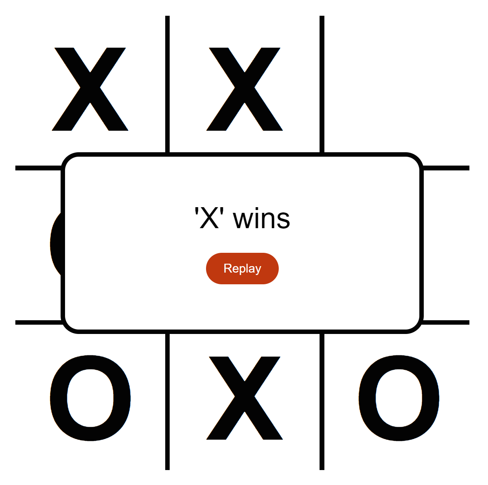

---

nav_exclude: true
---

# Javascript - Noughts and Crosses

### 


In this tutorial, we will show you how to build a noughts and crosses game using HTML, CSS and JavaScript.

In this game there are two players, the player who is first to get three in row wins. If nobody gets three in a row then it's a draw.

We'll be using an online environment called [syncfiddle](https://syncfiddle.net/) to build the game.


## Laying out the board

We'll start with a basic HTML document.

```html
<!DOCTYPE html>
 
<html>
    <head>
      <meta http-equiv="Content-Type" content="text/html; charset=utf-8"/>
      <title>Noughts and Crosses</title>
    <style>
    </style>
    </head>

    <body>
    </body>
    
    <script>
    </script>
</html>
```

This is about the most simple HTML document you can create. 

Let's add the HTML for the game board. Add the following between the <body></body> tags.

```html
<body>

    <div class="container">
        <div class="square" data-index="1"></div>
        <div class="square" data-index="2"></div>
        <div class="square" data-index="3"></div>
        <div class="square" data-index="4"></div>
        <div class="square" data-index="5"></div>
        <div class="square" data-index="6"></div>
        <div class="square" data-index="7"></div>
        <div class="square" data-index="8"></div>
        <div class="square" data-index="9"></div>
    </div>

</body>
```

This lays out a game board with 9 squares. We'll use these squares to display the X or the O when the player decides where to go.


## Add some styling

We need to add some styling to the page to make it look like a game board. 

Add the following style to your HTML document. You'll need to add this between the <style></style> tags.

```css
*{
    box-sizing: border-box;
    font-family: sans-serif;
}
```

This applies to everything (that's what the * means).


```css
body{
    margin: 0;
    padding: 0;
    width: 100%;
    height: 100vh;
    display: flex;
    justify-content: center;
    align-items: center;
    background-color: #fff;
}
```

Add some styling to the body of the document.


```css
.container{
    width: 500px;
    height: 500px;
    display: grid;
    background-color: #000;
    grid-gap: 5px;
    grid-template-columns: 33% 33% 33%;
    grid-auto-rows: 33% 33% 33%;
}
```

This will style our container (the board) .


```css
.square{
    position: relative;
    background-color: #fff;
    cursor: pointer;
}
.square::before{
    position: absolute;
    top: 0; right: 0; bottom: 0; left: 0;
    display: flex;
    justify-content: center;
    align-items: center;
    font-weight: bold;
    font-size: 8rem;
}
.square.x::before{
    content: "X";
}
.square.o::before{
    content: "O";
}
```

A bit of styling makes our squares look good.

 

```
.winner{
    display: flex;
    flex-direction: column;
    align-items: center;
    justify-content: center;
    position: fixed;
    width: 400px;
    height: 200px;
    padding: 20px 40px;
    background-color: #fff;
    font-size: 2rem;
    border-radius: 20px;
    text-align: center;
    animation: animate .5s linear;
    border: 5px solid;
}
@keyframes animate{
    from{
      opacity: 0;
    }
    to{
      opacity: 1;
    }
}
.winner button{
    margin-top: 20px;
    width: 80px;
    height: 35px;
    line-height: 35px;
    padding: 0;
    border: 0;
    outline: 0;
    border-radius: 20px;
    cursor: pointer;
    color: #fff;
    background-color: #BF360C;
}
```

And finally some style to display a nice message 

Now if you click the Run button you should see the noughts and crosses board displayed.


## Adding the game code

Now we'll add some JavaScript code to make the game work. 

**Important**: You'll add this code between the <script></script> tags.

The first part is to setup our squares, what the winning combinations are and two variables so we can keep track of where each player has gone.

```javascript
const squares = Array.from(document.querySelectorAll(".square"));
const winningCombinations = [[1,2,3],[4,5,6],[7,8,9],[1,5,9],[3,5,7],[1,4,7],[2,5,8],[3,6,9]];
let firstPlayer = [], secondPlayer = [], count = 0;
```

You can see we are using 2 different ways of creating variables - const and let. If the variable you care creating will not change then it's a const (constant) if you'll need to change it later then it has to be declared using let. 

Now we'll add some code that 'listens' for the players 'click'ing in a square. When they click a square the 'move' code gets run.

```javascript
squares.forEach(square => square.addEventListener("click", move));
```

When the player clicks in a square we need to check who's go it is and then put in either an 'X' or an 'O'.  First we make sure they have clicked in a square. Then we increment a counter - this is so we can keep track of which players turn it is.  We can now check which player has gone by using the [modulus operator (%)](https://developer.mozilla.org/en-US/docs/Web/JavaScript/Reference/Operators/Remainder) if it's 0 then it's Player 1's turn otherwise it's Player 2's go.  We then add either a 'X' or 'O' class to the square to indicate who has clicked in there. We also add the index of the square to the list of squares a player has so we can check if they have a winning combination by calling 'checkForWinner'. If a player does have a winning combination then we call 'showWinner' with the name of Player that has won. 

```javascript
function move(){
  if(this.classList == "square"){
    count++;
    if(count % 2 !== 0){
      this.classList.add("x");
      firstPlayer.push(Number(this.dataset.index));
      if(checkForWinner(firstPlayer)){        
        showWinner("'X' wins");
        return true;
      }
    } else{
      this.classList.add("o");
      secondPlayer.push(Number(this.dataset.index));
      if(checkForWinner(secondPlayer)){
        showWinner("'O' wins");
        return true;
      }
    }
    if(count === 9){
      showWinner("It was a Draw");
    }
  }
}		
```

Here's the 'checkForWinner' function. It takes an array (which will be the list of squares a player has) and checks to see if it contains a winning combination. If it does we return true otherwise we return false.

```javascript
function checkForWinner(array){
  let finalResult = false;
  for(let item of winningCombinations){
    let res = item.every(val => array.indexOf(val) !== -1);
    if(res){
      return true;
    }
  }
  return false;
}
```

If there is a winner the 'showWinner' function will create some new HTML to display a box showing who has won and also a button they can click to have another go.

```javascript
function showWinner(p){
  const modal = document.createElement("div");
  const player = document.createTextNode(p);
  const replayButton = document.createElement("button");
  modal.classList.add("winner");
  modal.appendChild(player);
  replayButton.appendChild(document.createTextNode("Replay"));
  replayButton.onclick = function() { replay() };
  modal.appendChild(replayButton);
  document.body.appendChild(modal);
}
```

If they want another go we'll need to clear the board from the previous game. So we remove the winner box, reset the list of squares each player has, reset the count of goes and then remove all the 'X' and 'O' from the squares.

```javascript
function replay(){
  const winnerDialog = document.querySelector(".winner");  
  winnerDialog.remove();  
  firstPlayer = [];
  secondPlayer = [];
  count = 0;
  squares.forEach(square => {
	square.classList.remove("x");
	  square.classList.remove("o");
  });
}
```

That's it. If you've copied the code correctly you should now be able to click the Run button and play a game of Noughts and Crosses. If you find it's not working correctly double check your code for any bugs - or you can check the console in syncfiddle, it's at the bottom of the screen if you click and drag the bar using the double lines in the middle you should see the console displayed. If there are any errors in here it could help you to debug your code.


Here's what the final HTML document and code should look like.

```html
<!DOCTYPE html>

<html>
    <head>
        <meta http-equiv="Content-Type" content="text/html; charset=utf-8" />
        <title>Noughts and Crosses</title>
        <style>
            * {
                box-sizing: border-box;
                font-family: sans-serif;
            }
            body {
                margin: 0;
                padding: 0;
                width: 100%;
                height: 100vh;
                display: flex;
                justify-content: center;
                align-items: center;
                background-color: #fff;
            }
            .container {
                width: 500px;
                height: 500px;
                display: grid;
                background-color: #000;
                grid-gap: 5px;
                grid-template-columns: 33% 33% 33%;
                grid-auto-rows: 33% 33% 33%;
            }
            .square {
                position: relative;
                background-color: #fff;
                cursor: pointer;
            }
            .square::before {
                position: absolute;
                top: 0;
                right: 0;
                bottom: 0;
                left: 0;
                display: flex;
                justify-content: center;
                align-items: center;
                font-weight: bold;
                font-size: 8rem;
            }
            .square.x::before {
                content: "X";
            }
            .square.o::before {
                content: "O";
            }

            .winner {
                display: flex;
                flex-direction: column;
                align-items: center;
                justify-content: center;
                position: fixed;
                width: 400px;
                height: 200px;
                padding: 20px 40px;
                background-color: #fff;
                font-size: 2rem;
                border-radius: 20px;
                text-align: center;
                animation: animate 0.5s linear;
                border: 5px solid;
            }
            @keyframes animate {
                from {
                    opacity: 0;
                }
                to {
                    opacity: 1;
                }
            }
            .winner button {
                margin-top: 20px;
                width: 80px;
                height: 35px;
                line-height: 35px;
                padding: 0;
                border: 0;
                outline: 0;
                border-radius: 20px;
                cursor: pointer;
                color: #fff;
                background-color: #bf360c;
            }
        </style>
    </head>

    <body>
        <div class="container">
            <div class="square" data-index="1"></div>
            <div class="square" data-index="2"></div>
            <div class="square" data-index="3"></div>
            <div class="square" data-index="4"></div>
            <div class="square" data-index="5"></div>
            <div class="square" data-index="6"></div>
            <div class="square" data-index="7"></div>
            <div class="square" data-index="8"></div>
            <div class="square" data-index="9"></div>
        </div>
    </body>

    <script>
        const squares = Array.from(document.querySelectorAll(".square"));
        const winningCombinations = [
            [1, 2, 3],
            [4, 5, 6],
            [7, 8, 9],
            [1, 5, 9],
            [3, 5, 7],
            [1, 4, 7],
            [2, 5, 8],
            [3, 6, 9],
        ];
        let firstPlayer = [],
            secondPlayer = [],
            count = 0;

        squares.forEach((square) => square.addEventListener("click", move));

        function move() {
            if (this.classList == "square") {
                count++;
                if (count % 2 !== 0) {
                    this.classList.add("x");
                    firstPlayer.push(Number(this.dataset.index));
                    if (checkForWinner(firstPlayer)) {
                        showWinner("'X' wins");
                        return true;
                    }
                } else {
                    this.classList.add("o");
                    secondPlayer.push(Number(this.dataset.index));
                    if (checkForWinner(secondPlayer)) {
                        showWinner("'O' wins");
                        return true;
                    }
                }
                if (count === 9) {
                    showWinner("It was a Draw");
                }
            }
        }

        function checkForWinner(array) {
            let finalResult = false;
            for (let item of winningCombinations) {
                let res = item.every((val) => array.indexOf(val) !== -1);
                if (res) {
                    return true;
                }
            }
            return false;
        }

        function showWinner(p) {
            const modal = document.createElement("div");
            const player = document.createTextNode(p);
            const replayButton = document.createElement("button");
            modal.classList.add("winner");
            modal.appendChild(player);
            replayButton.appendChild(document.createTextNode("Replay"));
            replayButton.onclick = function () {
                replay();
            };
            modal.appendChild(replayButton);
            document.body.appendChild(modal);
        }

        function replay() {
            const winner = document.querySelector(".winner");
            winner.remove();
            firstPlayer = [];
            secondPlayer = [];
            count = 0;
            squares.forEach((square) => {
                square.classList.remove("x");
                square.classList.remove("o");
            });
        }
    </script>
</html>	
```


### More things to do

Change the colours of the X and O so they are different - maybe red and blue

Add scores so you can see who has won the most times - add some variables to record how many times each player has won

